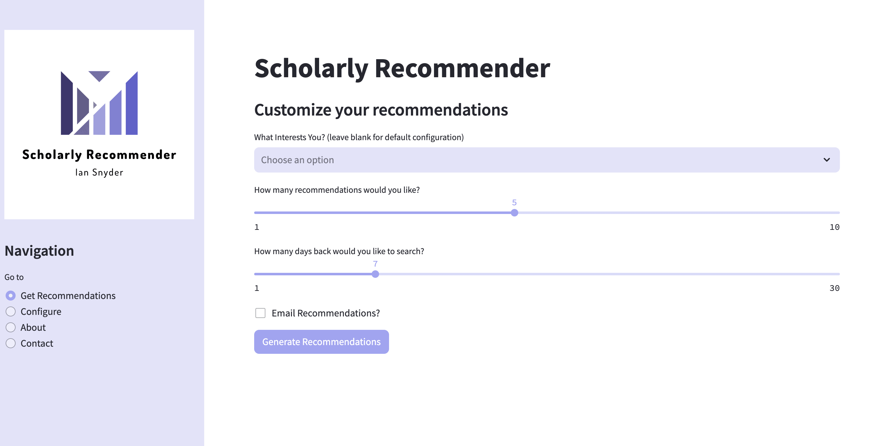

<a name="readme-top"></a>

<!-- PROJECT LOGO -->
<br />
<div align="center">
  <a href="https://github.com/iansnyder333/ScholarlyRecommender">
    
  </a>

<h3 align="center">Scholarly Recommender</h3>

  <p align="center">
    End-to-end product that sources recent academic publications and prepares a feed of recommended readings in seconds. 
    <br />
    <a href="https://iansnyder333-scholarlyrecommender-webapp-tflhbc.streamlit.app/"><strong>Try it now »</strong></a>
    <br />
    <br />
    <a href="https://github.com/iansnyder333/ScholarlyRecommender">View Demo</a>
    ·
    <a href="https://github.com/iansnyder333/ScholarlyRecommender/issues">Report Bug</a>
    ·
    <a href="https://github.com/iansnyder333/ScholarlyRecommender/issues">Request Feature</a>
  </p>
</div>

<!-- TABLE OF CONTENTS -->
<details>
  <summary>Table of Contents</summary>
  <ol>
    <li>
      <a href="#about-the-project">About The Project</a>
      <ul>
        <li><a href="#built-with">Built With</a></li>
      </ul>
    </li>
    <li>
      <a href="#getting-started">Getting Started</a>
      <ul>
        <li><a href="#prerequisites">Prerequisites</a></li>
        <li><a href="#installation">Installation</a></li>
      </ul>
    </li>
    <li><a href="#usage">Usage</a></li>
    <li><a href="#roadmap">Roadmap</a></li>
    <li><a href="#contributing">Contributing</a></li>
    <li><a href="#license">License</a></li>
    <li><a href="#contact">Contact</a></li>
    <li><a href="#methods">Methods</a></li>
  </ol>
</details>

## About The Project

<div align="center">
  <a href="https://github.com/iansnyder333/ScholarlyRecommender">
    
  </a>
</div>

  
  As an upcoming data scientist with a strong passion for deep learning, I am always looking for new technologies and methodologies. Naturally, I spend a considerable amount of time researching and reading new publications to accomplish this. However, **over 14,000 academic papers are published every day** on average, making it extremely tedious to continuously source papers relevant to my interests. My primary motivation for creating ScholarlyRecommender is to address this, creating a fully automated and personalized system that prepares a feed of academic papers relevant to me. This feed is prepared on demand, through a completely abstracted streamlit web interface, or sent directly to my email on a timed basis. This project was designed to be scalable and adaptable, and can be very easily adapted not only to your own interests, but become a fully automated, self improving newsletter. Details on how to use this system, the methods used for retrieval and ranking, along with future plans and features planned or in development currently are listed below.


<p align="right">(<a href="#readme-top">back to top</a>)</p>

### Built With

[![Python][Python.com]][Python-url]
[![Streamlit][Streamlit.com]][Python-url]
[![Pandas][Pandas.com]][Pandas-url]
[![NumPy][Numpy.com]][Numpy-url]
[![Arxiv.arxiv][Arxiv.arxiv.com]][Arxiv.arxiv-url]
  
<p align="right">(<a href="#readme-top">back to top</a>)</p>


<!-- GETTING STARTED -->
## Getting Started

To try ScholarlyRecommender, you can use the streamlit web application found  [Here](https://iansnyder333-scholarlyrecommender-webapp-tflhbc.streamlit.app/). This will allow you to use the system in its entirety without needing to install anything. If you want to modify the system internally or add functionality, you can follow the directions below to install it locally. 

### Prerequisites

In order to install this app locally you need to have git along with a suitable Python version. This app was developed using Python 3.11 and has not been tested on any earlier versions.


### Installation

MacOS
1. Clone the repo
   ```sh
   git clone https://github.com/iansnyder333/ScholarlyRecommender.git
   ```
2. cd into the repo and setup a enviroment
   ```sh
   cd ScholarlyRecommender
   python3.11 -m venv env
   source env/bin/activate
   ```
3. install dependencies 
   ```sh
   pip3.11 install -r requirements.txt
   ```

<p align="right">(<a href="#readme-top">back to top</a>)</p>


<!-- USAGE EXAMPLES -->
## Usage

Once installed, you want to calibrate the system to your own interests. The easiest way to do this is using the webapp.py file. Alternativley, you can use calibrate.py, which runs in the terminal.

Make sure you are cd into the parent folder of the cloned repo.

Run this in your terminal as follows:
```sh
streamlit run webapp.py
```

Navigate to the configure tab and complete the steps. You can now navigate back to the get recommendations tab and generate results!
The web app offers full functionality and serves as an api to the system, while using the webapp, updates made to the configuration will be applied and refreshed in a continuous manner. 


<p align="right">(<a href="#readme-top">back to top</a>)</p>

<!-- ROADMAP -->
## Roadmap

- [ ] Adding email support on the web app
- [ ] Making it easier to give feedback to suggested papers to improve the system
- [ ] Many visual and user experience improvements


See the [open issues](https://github.com/iansnyder333/ScholarlyRecommender/issues) for a full list of proposed features (and known issues).

<p align="right">(<a href="#readme-top">back to top</a>)</p>


<!-- CONTRIBUTING -->
## Contributing

Contributions are what make the open source community such an amazing place to learn, inspire, and create. Any contributions you make are **greatly appreciated**.

If you have a suggestion that would make this better, please fork the repo and create a pull request. You can also simply open an issue with the tag "enhancement".
Don't forget to give the project a star! Thanks again!

1. Fork the Project
2. Create your Feature Branch (`git checkout -b feature/AmazingFeature`)
3. Commit your Changes (`git commit -m 'Add some AmazingFeature'`)
4. Push to the Branch (`git push origin feature/AmazingFeature`)
5. Open a Pull Request

<p align="right">(<a href="#readme-top">back to top</a>)</p>

<!-- LICENSE -->
## License

Distributed under the apache license 2.0. See `LICENSE` for more information. 

<p align="right">(<a href="#readme-top">back to top</a>)</p>


<!-- CONTACT -->
## Contact

Ian Snyder - [@iansnydes](https://twitter.com/iansnydes) - idsnyder136@gmail.com 

Project Email - scholarlyrecommender@gmail.com

My Website: [iansnyder333.github.io/frontend/](https://iansnyder333.github.io/frontend/)

Linkedin: [www.linkedin.com/in/ian-snyder-aa1600182/](https://www.linkedin.com/in/ian-snyder-aa1600182/)

<p align="right">(<a href="#readme-top">back to top</a>)</p>

<!-- METHODS -->
## Methods 

Once candidates are sourced in the context of the configuration, they are ranked. The ranking process involves using the normalized compression distance combined with an inverse weighted top-k mean rating from the candidates to the labeled papers. This is a modified version of the algorithm described in the paper "“Low-Resource” Text Classification- A Parameter-Free Classification Method with Compressors." The algorithm gets the top k most similar papers to each paper in the context that the user rated and calculates a weighted mean rating of those papers as its prediction. The results are then sorted by the papers with the highest predicting rating and are returned in accordance with the desired amount.

This is by no means the best approach to source relevant content, but is a fairly accurate and lightweight one that can run on limited hardware with very little "training" data. 

<p align="right">(<a href="#readme-top">back to top</a>)</p>


<!-- MARKDOWN LINKS & IMAGES -->
<!-- https://www.markdownguide.org/basic-syntax/#reference-style-links -->
[Python.com]:https://img.shields.io/badge/Python-blue
[Python-url]:https://www.python.org/
[Streamlit.com]:https://img.shields.io/badge/Streamlit-red
[Streamlit-url]:https://streamlit.io/
[Pandas.com]:https://img.shields.io/badge/pandas-purple
[Pandas-url]:https://pandas.pydata.org/
[Numpy.com]:https://img.shields.io/badge/NumPy-%23ADD8E6
[Numpy-url]:https://numpy.org/
[Arxiv.arxiv.com]:https://img.shields.io/badge/Arxiv-%23FF0000
[Arxiv.arxiv-url]:http://lukasschwab.me/arxiv.py/index.html

